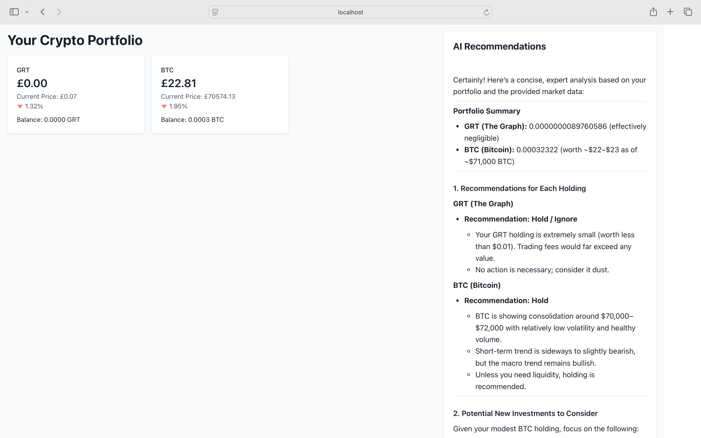

# Crypto Viewer

Crypto Viewer is a web application built with React, TypeScript, and Vite for tracking cryptocurrency portfolios and prices. It includes a Python FastAPI backend that interfaces with the Coinbase Advanced Trade API for real-time data and OpenAI for crypto analysis.



## Features

- View your cryptocurrency portfolio with real-time updates.
- Fetch live cryptocurrency prices and historical data.
- Responsive design using Chakra UI.
- Backend integration with Coinbase Advanced Trade API.

## Prerequisites

Before you begin, ensure you have the following installed:

- [Node.js](https://nodejs.org/) (version 16 or higher)
- [Python](https://www.python.org/) (version 3.9 or higher)
- [Poetry](https://python-poetry.org/) for Python dependency management
- [Git](https://git-scm.com/) for version control

## Setup

### 1. Clone the Repository

```bash
git clone https://github.com/your-username/crypto-viewer.git
cd crypto-viewer
```

### 2. Install Frontend Dependencies

Navigate to the frontend directory and install the required dependencies:

```bash
cd src
npm install
```

### 3. Set Up the Backend

Navigate to the backend directory and install dependencies using Poetry:

```bash
cd ../server_py
poetry install
```

### 4. Configure Environment Variables

Create a `.env` file in the `server_py` directory with the following variables:

```env
COINBASE_API_KEY=your_coinbase_api_key
COINBASE_API_SECRET=your_coinbase_api_secret
```

Replace `your_coinbase_api_key` and `your_coinbase_api_secret` with your Coinbase API credentials.

## Running the Application

### 1. Start the Backend Server

Run the following command in the `server_py` directory:

```bash
poetry run uvicorn app.main:app --reload
```

The backend server will start at `http://127.0.0.1:8000`.

### 2. Start the Frontend Development Server

Navigate back to the `src` directory and start the frontend:

```bash
npm run dev
```

The frontend will be available at `http://127.0.0.1:5173`.

## API Endpoints

The backend provides the following API endpoints:

- **GET /api/crypto/portfolio**: Fetches the user's cryptocurrency portfolio.
- **GET /api/crypto/price/{currency}**: Fetches the current price of a cryptocurrency.
- **GET /api/crypto/historical/{currency}**: Fetches historical data for a cryptocurrency.

## Development

### Linting and Formatting

- Run ESLint for linting:

  ```bash
  npm run lint
  ```

- Run Prettier for formatting:

  ```bash
  npm run format
  ```

### Testing

- Backend tests can be run using `pytest`:

  ```bash
  poetry run pytest
  ```

- Frontend tests can be run using `npm`:

  ```bash
  npm run test
  ```

## Deployment

To deploy the application, build the frontend and serve it with the backend:

1. Build the frontend:

   ```bash
   npm run build
   ```

2. Move the built files to the backend's `static` directory.

3. Configure the backend to serve static files.

4. Deploy the backend using a production server like Gunicorn or Docker.

## Contributing

Contributions are welcome! Please follow these steps:

1. Fork the repository.
2. Create a new branch (`git checkout -b feature-name`).
3. Commit your changes (`git commit -m 'Add feature'`).
4. Push to the branch (`git push origin feature-name`).
5. Open a pull request.

## License

This project is licensed under the MIT License. See the [LICENSE](LICENSE) file for details.

## Acknowledgments

- [Coinbase Advanced Trade API](https://docs.cloud.coinbase.com/advanced-trade-api/docs/welcome)
- [Chakra UI](https://chakra-ui.com/)
- [React Query](https://tanstack.com/query/latest)
- [Chart.js](https://www.chartjs.org/)
