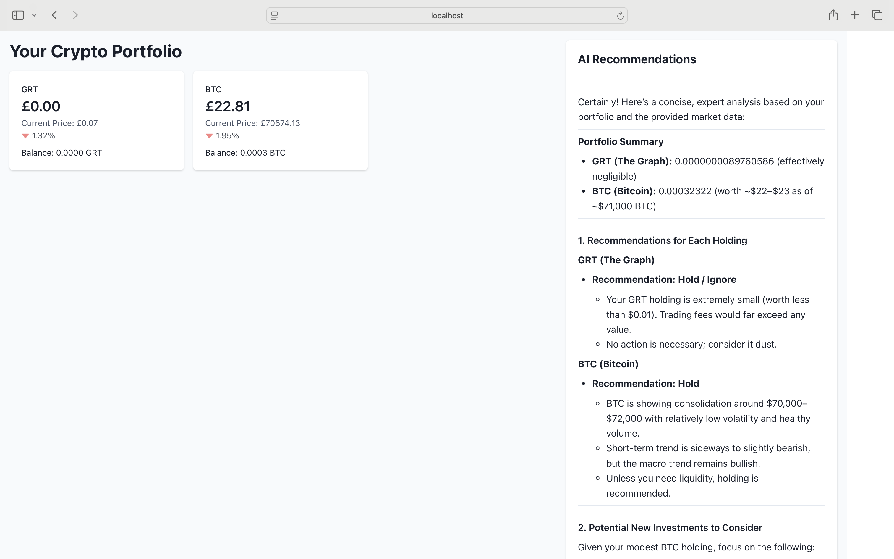

# Crypto Viewer

Crypto Viewer is a web application built with React, TypeScript, and Vite for tracking cryptocurrency portfolios and prices. It includes a Python FastAPI backend that interfaces with the Coinbase Advanced Trade API for real-time data and OpenAI for AI-powered crypto analysis and recommendations.



## Features

- View your cryptocurrency portfolio with real-time updates (30-second refresh)
- Fetch live cryptocurrency prices with 24-hour change indicators
- Per-asset detail pages with a 24-hour price chart and an accessible data-table alternative
- Grounded, confidence-rated AI recommendations: every claim is traced to a named
  data field, verified server-side, and rated against a documented rubric
  (see [Grounded recommendations](#grounded-recommendations))
- Light and dark themes built on a shared design-token system
- Responsive design (desktop, tablet, mobile) using Chakra UI components
- Accessible to WCAG 2.1 AA, verified by automated axe-core scans in CI
- Real-time integration with Coinbase Advanced Trade API
- Historical price data visualization

## Prerequisites

Before you begin, ensure you have the following installed:

- [Node.js](https://nodejs.org/) (version 16 or higher)
- [Python](https://www.python.org/) (version 3.9 or higher)
- [Git](https://git-scm.com/) for version control

## Setup

### 1. Clone the Repository

```bash
git clone https://github.com/your-username/crypto-viewer.git
cd crypto-viewer
```

### 2. Install Frontend Dependencies

Install the required dependencies in the root directory:

```bash
npm install
```

### 3. Set Up the Backend

Navigate to the backend directory and set up a Python virtual environment:

```bash
cd server_py
python -m venv venv
source venv/bin/activate  # On Windows: venv\Scripts\activate
pip install -r requirements.txt
```

### 4. Configure Environment Variables

Create a `.env` file in the `server_py` directory with the following variables:

```env
COINBASE_API_KEY=your_coinbase_api_key
COINBASE_API_SECRET=your_coinbase_api_secret
OPENAI_API_KEY=your_openai_api_key
```

Replace the placeholder values with your actual API credentials:
- Get Coinbase API credentials from [Coinbase Developer Portal](https://docs.cloud.coinbase.com/advanced-trade-api/docs/rest-api-auth)
- Get OpenAI API key from [OpenAI Platform](https://platform.openai.com/api-keys)

## Running the Application

### 1. Start the Backend Server

Run the following command in the `server_py` directory:

```bash
cd server_py
source venv/bin/activate  # On Windows: venv\Scripts\activate
python run.py
```

The backend server will start at `http://127.0.0.1:3001`.

### 2. Start the Frontend Development Server

Navigate back to the root directory and start the frontend:

```bash
npm run dev
```

The frontend will be available at `http://127.0.0.1:5173`.

### 3. One-Command Development Setup

Alternatively, you can start both frontend and backend simultaneously from the root directory:

```bash
npm run dev
```

This command automatically starts both the backend server and frontend development server.

## API Endpoints

The backend provides the following API endpoints:

- **GET /api/crypto/portfolio**: Fetches the user's cryptocurrency portfolio with balances
- **GET /api/crypto/price/{product_id}**: Fetches current price for a trading pair (e.g., BTC-GBP)
- **GET /api/crypto/historical/{product_id}**: Fetches historical price data for a trading pair
- **GET /api/recommendations/**: Generates grounded, confidence-rated recommendations
- **GET /api/recommendations/analysis**: Alias of the above, kept for existing callers

## Grounded recommendations

Recommendations are not free text from a model. The pipeline is built so that
every figure shown can be traced back to data the app actually fetched, and so
that a thin evidence base produces a *lower confidence rating* rather than
confident-sounding prose written around the gap.

### How a recommendation is produced

1. **Grounding context** (`app/services/context_builder.py`). Portfolio
   balances and prices come from Coinbase; 300 daily candles per asset feed
   technical indicators computed **in code, never by the model**
   (`app/services/indicators.py`): RSI(14), MACD(12,26,9), 50/200-day moving
   averages with a golden/death-cross state, 30-day annualised volatility and
   distance from the period high. Market cap, circulating supply and distance
   from the all-time high come from CoinGecko; the Fear & Greed Index from
   alternative.me.

   Every field is named (`BTC.rsi_14`, `market.fear_greed_index`) and every
   field that could not be computed is present and marked `unavailable`, with
   the reason. A gap the model cannot see is a gap it cannot react to.

2. **Structured model call** (`app/services/ai_service.py`). The system prompt
   makes the field list a closed world: cite these names, copy their values
   exactly, treat `unavailable` as a reason to lower confidence. The call uses
   OpenAI structured outputs against a JSON schema at `temperature=0.25`, and
   the reply is validated into a Pydantic model before anything downstream sees
   it.

3. **Groundedness check** (`app/services/groundedness.py`). Every supporting
   fact is re-read against the context. An invented field or a value asserted
   for an `unavailable` field is **dropped**; a misquoted number is
   **corrected to the measured value**. On any violation the model is asked
   once more with the specific corrections named; if the second attempt still
   fails, the affected confidence rating is downgraded. The served payload can
   never contain a number the app did not measure.

4. **Disclaimer and logging** (`app/services/recommendation_service.py`). The
   disclaimer is a server-side constant injected after the model call, so it
   cannot be dropped or reworded. Each run appends the grounding context, the
   model output, the check result and the price at call time to
   `server_py/logs/recommendations.jsonl`.

### Confidence rubric

The rubric lives in `app/schemas/grounding.py` and is used in three places: the
system prompt, the deterministic ceiling below, and the API response.

| Rating | Requires |
| --- | --- |
| **high** | ≥3 independent signal categories available, ≥3 agreeing, no available category contradicting the call, and ≥80% data completeness |
| **medium** | ≥2 categories available, a majority agreeing, and ≥50% data completeness |
| **low** | <2 categories available, **or** the categories disagree, **or** completeness <50%, **or** the call rests mainly on one metric |

Signal categories are *trend*, *momentum*, *volatility*, *sentiment* and
*market structure*, grouped so that four momentum readings agreeing with each
other cannot masquerade as four independent confirmations.

The model rates itself against this rubric, but the rating it gets to keep is
`min(model_confidence, data_ceiling)` — the ceiling is computed from
completeness and category coverage alone. The response exposes both, plus
`ceiling_reason`, so a capped rating is visible rather than silent.

### Out of scope for this pass

True on-chain data — exchange netflows, MVRV, whale wallet activity — needs a
paid provider (Glassnode, CryptoQuant, Santiment) and is **not** included.
Approximating it from price and volume would manufacture exactly the kind of
confident, unverifiable claim this pipeline exists to prevent, so those fields
are simply absent rather than faked.

## Development

### Linting and Formatting

- Run ESLint for linting:

  ```bash
  npm run lint
  ```

### Type checking

```bash
npm run typecheck   # tsc -b across the app, build tooling and E2E projects
```

### Testing

#### Backend (pytest)

```bash
cd server_py
source venv/bin/activate  # On Windows: venv\Scripts\activate
pytest
```

Run specific test files:

```bash
pytest test_ai_service.py
pytest test_coinbase_service.py
pytest test_crypto_router.py
pytest test_indicators.py            # technical indicators
pytest test_context_builder.py       # grounding context and its degradation
pytest test_groundedness.py          # verification and the confidence rubric
pytest test_recommendations_router.py
```

The backend suite runs in **test mode** (see below), so it needs no API
credentials and makes no third-party requests.

#### End-to-end (Playwright)

```bash
npx playwright test          # or: npm run test:e2e
npm run test:e2e:ui          # interactive runner
npm run test:e2e:report      # open the last HTML report
```

Playwright starts everything it needs: a FastAPI backend in test mode on port
`3101` and a production frontend build served by `vite preview` on port `4173`
with `/api` proxied to the backend. Tests therefore exercise the real
frontend ↔ backend HTTP path; only the outbound Coinbase and OpenAI calls are
faked. A fixture fails any test whose browser tries to reach a non-local host,
so "no real third-party calls" is enforced rather than assumed.

Full-page screenshots of every major view at 1440px, 768px and 375px are
written to [`screenshots/`](screenshots) as part of the run.

### Backend test mode

Setting `CRYPTO_VIEWER_TEST_MODE=1` swaps the Coinbase and OpenAI clients for
in-process fakes that serve fixture data
(`server_py/app/services/fakes/`). Nothing else about the application changes:
the same routers, dependency wiring and HTTP stack are used.

```bash
cd server_py
CRYPTO_VIEWER_TEST_MODE=1 ./venv/bin/python -m uvicorn app.main:app --port 3001
```

Individual scenarios are selected per request with the `cv_test_scenario`
cookie, so parallel tests never interfere with one another. Flags may be
combined with commas:

| Flag | Behaviour |
| --- | --- |
| `empty-portfolio` | Portfolio returns no holdings |
| `error-portfolio` | Portfolio request fails (HTTP 500) |
| `error-prices` | Price lookups return an `error` payload |
| `error-historical` | Candle history request fails |
| `error-ai` | Analysis request fails (HTTP 500) |
| `degraded-ai` | Model is unreachable; a 200 carries an explanation instead of calls |
| `short-history` | Only 40 daily candles, so the moving averages cannot be computed (costs the `trend` category) |
| `error-market-context` | CoinGecko and Fear & Greed unreachable (costs `sentiment` and `market_structure`) |
| `partial-data` | Both of the above: the low-confidence case |
| `ungrounded-ai` | Model quotes a figure not in the grounding context and cites a field that does not exist |
| `slow-portfolio`, `slow-prices`, `slow-historical`, `slow-ai` | Delay that response by ~1.2s |
| `slow` / `error` | Apply every slow / error flag at once |

The grounding-data flags do not simulate an outage — the pipeline still
answers under them. They exist so the confidence rubric and the groundedness
check can be exercised end to end.

## Deployment

To deploy the application, build the frontend and serve it with the backend:

1. Build the frontend:

   ```bash
   npm run build
   ```

2. The built files will be in the `dist` directory.

3. Deploy the backend using a production server like Gunicorn:

   ```bash
   cd server_py
   pip install gunicorn
   gunicorn app.main:app -w 4 -k uvicorn.workers.UvicornWorker
   ```

## Contributing

Contributions are welcome! Please follow these steps:

1. Fork the repository.
2. Create a new branch (`git checkout -b feature-name`).
3. Commit your changes (`git commit -m 'Add feature'`).
4. Push to the branch (`git push origin feature-name`).
5. Open a pull request.

## License

This project is licensed under the MIT License. See the [LICENSE](LICENSE) file for details.

## Acknowledgments

- [Coinbase Advanced Trade API](https://docs.cloud.coinbase.com/advanced-trade-api/docs/welcome)
- [Chakra UI](https://chakra-ui.com/)
- [React Query](https://tanstack.com/query/latest)
- [Chart.js](https://www.chartjs.org/)
